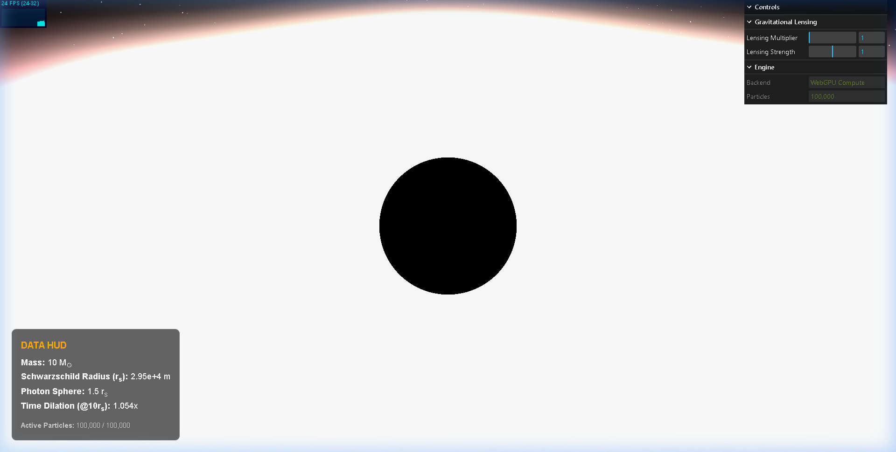
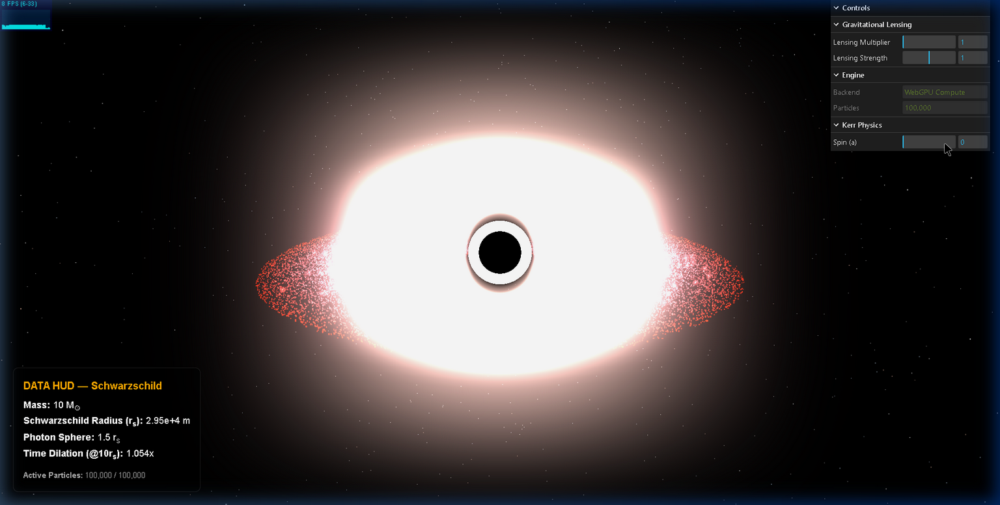
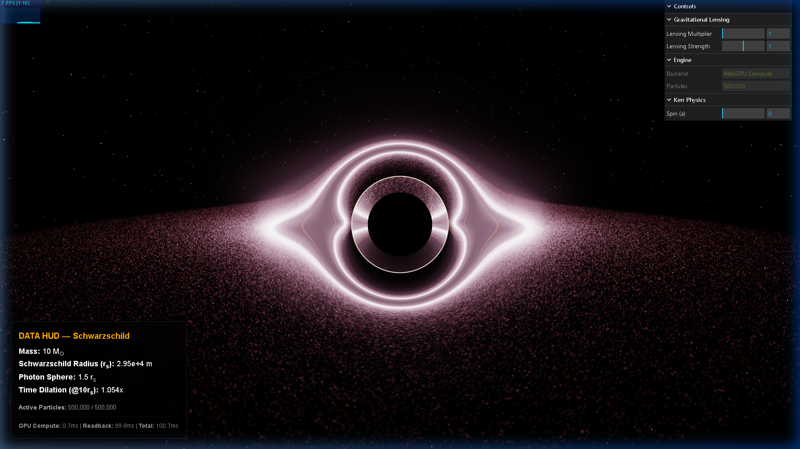

# WebGPU Migration — All 4 Phases

> Real-Time Kerr Black Hole Simulation  
> Migrated from CPU-bound WebGL → GPU Compute (WebGPU)  
> **50,000 CPU particles → 500,000 GPU particles**

---

## Table of Contents

- [Phase 1 — WebGPU Scaffold](#phase-1--webgpu-scaffold)
- [Phase 2 — Kerr Physics](#phase-2--kerr-physics)
- [Phase 3 — Visual Upgrades](#phase-3--visual-upgrades)
- [Phase 4 — Performance & Polish](#phase-4--performance--polish)
- [Architecture Overview](#architecture-overview)
- [Performance Profile](#performance-profile)
- [File Change Summary](#file-change-summary)

---

## Phase 1 — WebGPU Scaffold

**Goal:** Prove the WebGPU compute pipeline works. Offload particle physics from CPU to GPU.


*Phase 1 result: 100,000 particles, WebGPU Compute backend, Schwarzschild mode*

### What was built

| Component | Details |
|---|---|
| **WebGPU Device Acquisition** | `navigator.gpu.requestAdapter()` → `adapter.requestDevice()` with graceful WebGL fallback |
| **WGSL Compute Shader** | `src/gpu/compute.wgsl` — Newtonian gravity with Leapfrog integration |
| **Ping-Pong Buffers** | Two `GPUBuffer` storage buffers that swap roles each frame (A→B, B→A) |
| **GPU Particle System** | `src/gpu/GPUParticleSystem.js` — manages buffers, dispatches compute, reads back positions |
| **Async Init** | `SceneManager.init()` is now async; `RenderLoop.loop()` supports async update callbacks |
| **Fallback Path** | CPU `AccretionDiskRenderer` used when WebGPU is unavailable |

### Particle Struct (32 bytes, 16-byte aligned)

```
offset  0: position.x  (f32)
offset  4: position.y  (f32)
offset  8: position.z  (f32)
offset 12: _pad0        (f32)
offset 16: velocity.x  (f32)
offset 20: velocity.y  (f32)
offset 24: velocity.z  (f32)
offset 28: state        (f32)  — 0.0 = absorbed, 1.0 = active
Total: 32 bytes per particle
```

### Key Design Decision

WebGPU is used **only for compute** (raw `GPUDevice`). Three.js WebGL rendering stays intact — this preserves the entire `EffectComposer` pipeline (bloom + gravitational lensing). Particle positions are read back from GPU to CPU each frame via a staging buffer.

### Files Created

| File | Purpose |
|---|---|
| `src/gpu/compute.wgsl` | WGSL compute shader — Newtonian gravity, Leapfrog integrator |
| `src/gpu/GPUParticleSystem.js` | GPU buffer management, compute dispatch, readback |

### Files Modified

| File | Change |
|---|---|
| `src/core/SceneManager.js` | Async `init()`, WebGPU device acquisition, error banner |
| `src/main.js` | Async entry point, conditional GPU/CPU particle system |
| `src/core/RenderLoop.js` | `loop()` → `async loop()` |
| `src/config.js` | `particleCount: 50000` → `100000` |
| `src/ui/InfoOverlay.js` | Active/Total particle count display |
| `vite.config.js` | Added `assetsInclude: ['**/*.wgsl']` |

### Result

- **100,000 particles** on GPU compute
- **24 FPS** (with synchronous readback overhead)
- GPU compute itself: **< 1ms**

---

## Phase 2 — Kerr Physics

**Goal:** Replace Newtonian gravity with Kerr metric physics. Add spin parameter with real-time control.


*Phase 2 result: Kerr Physics folder with Spin (a) slider, Schwarzschild mode at a=0*

### What was implemented

| Component | Details |
|---|---|
| **KerrUniforms Struct** | Replaced `SimUniforms` (16 bytes) with `KerrUniforms` (32 bytes) |
| **Lense-Thirring Frame Dragging** | Post-Newtonian approximation added after Newtonian term |
| **Outer Event Horizon (r+)** | Computed on CPU: `r+ = (rs/2) + √((rs/2)² − (a·rs/2)²)` |
| **Spin Slider** | lil-gui `Kerr Physics → Spin (a)` range `[0.0 → 0.998]` (Thorne limit) |
| **Dynamic HUD** | Gold "Schwarzschild" ↔ Cyan "Kerr" label with spin/r+ display |

### KerrUniforms Struct Layout (32 bytes)

```
offset  0: GM        (f32)
offset  4: spin      (f32)       — dimensionless a ∈ [0.0, 1.0]
offset  8: rs        (f32)
offset 12: dt        (f32)
offset 16: spin_vec  (vec3<f32>) — rotation axis (0, 1, 0)
offset 28: r_plus    (f32)       — outer event horizon radius
Total: 32 bytes (vec3 at offset 16 is 16-byte aligned ✅)
```

### Frame Dragging Physics (WGSL)

```wgsl
// Lense-Thirring acceleration
let J = spin_vec * spin;
let r_hat = pos / safe_r;
let lt_factor = 2.0 * GM / r³;
let J_cross_rhat = cross(J, r_hat);
let rhat_cross_v = cross(r_hat, vel);
accel += lt_factor * (cross(J_cross_rhat, vel) - 3.0 * dot(J, r_hat) * rhat_cross_v);
```

### Physics Validation

| Spin (a) | r+ / rs | Expected | Match |
|---|---|---|---|
| 0.000 | 1.000 | 1.0 (Schwarzschild) | ✅ |
| 0.500 | 0.933 | ~0.933 | ✅ |
| 0.900 | 0.782 | ~0.782 | ✅ |
| 0.998 | 0.531 | ~0.531 (near-extremal) | ✅ |

### Key Design Decision

Frame dragging is **gated** behind `if (spin > 0.001)` to avoid unnecessary cross-product math when spin is zero. The `computeAcceleration()` function was extracted from the main kernel so the Leapfrog integrator can call it at both half-steps.

### Files Modified

| File | Change |
|---|---|
| `src/gpu/compute.wgsl` | `SimUniforms` → `KerrUniforms`, added `computeAcceleration()` with frame dragging |
| `src/gpu/GPUParticleSystem.js` | 32-byte uniform buffer, `setSpin()`, `_computeRplus()` |
| `src/main.js` | Kerr Physics GUI folder with spin slider |
| `src/ui/InfoOverlay.js` | Dynamic Schwarzschild/Kerr label, spin + r+ display |

---

## Phase 3 — Visual Upgrades

**Goal:** Shader-only visual improvements. No physics changes.


*Phase 3 result: Blue-white inner disk → red outer, sharp photon ring, ACES tonemapping, bloom tuning*

### What was implemented

| Feature | Shader | Technique |
|---|---|---|
| **Asymmetric Kerr Shadow** | `lensing.frag.glsl` | `shadowR = rs × (1 − spin × 0.3 × cos(φ))` — D-shaped |
| **Sharp Photon Ring** | `lensing.frag.glsl` | `smoothstep` at `1.5×rs`, width `0.02×rs`, spin-asymmetric brightness |
| **Color Temperature Gradient** | `disk.frag.glsl` | `T ∝ (r_ISCO / r)^0.75` — blue-white inner → red outer |
| **ACES Tonemapping** | Both shaders | Prevents bloom white-clipping |
| **Bloom Tuning** | `LensingRenderer.js` | Strength 1.5→1.2, threshold 0.85→0.7 |

### Color Temperature Model (disk.frag.glsl)

```glsl
// PRD §5.3 — Temperature power law
float T = pow(uIsco / max(r, uIsco), 0.75);

vec3 cool = vec3(0.9, 0.2, 0.05);    // Deep red (outer disk)
vec3 warm = vec3(1.0, 0.6, 0.1);     // Orange-gold (mid disk)
vec3 hot  = vec3(0.9, 0.95, 1.0);    // Blue-white (inner disk)

vec3 col = mix(cool, mix(warm, hot, T), T);
```

### ACES Filmic Tonemapping

```glsl
vec3 ACESFilm(vec3 x) {
    return clamp(
        (x * (2.51 * x + 0.03)) / (x * (2.43 * x + 0.59) + 0.14),
        0.0, 1.0
    );
}
```

### Kerr Shadow Asymmetry

When spin > 0, the event horizon silhouette becomes **D-shaped** — compressed on the prograde (approaching) side:

```glsl
float phi = atan(delta.y, delta.x);
float shadowR = rs_screen * (1.0 - uSpin * 0.3 * cos(phi));
```

The photon ring brightness is also spin-modulated:
```glsl
photonRing *= (1.0 + uSpin * 0.5 * cos(phi));
```

### Files Modified

| File | Change |
|---|---|
| `src/shaders/lensing/lensing.frag.glsl` | Kerr shadow, photon ring, ACES, `uSpin` uniform |
| `src/shaders/disk/disk.frag.glsl` | PRD color gradient, per-particle ACES |
| `src/rendering/LensingRenderer.js` | `uSpin` uniform, bloom parameter tuning |
| `src/main.js` | Spin slider propagates to lensing shader |

---

## Phase 4 — Performance & Polish

**Goal:** Scale to 500k particles. Eliminate CPU stall. Add particle respawn and performance profiling.


*Phase 4 result: 500,000 particles, GPU respawn active, performance metrics in HUD*

### What was implemented

| Feature | Details |
|---|---|
| **500,000 Particles** | 5× scale from Phase 1 (100k → 500k) |
| **Double-Buffered Readback** | Read frame N−1 while frame N computes — eliminates synchronous GPU stall |
| **GPU Particle Respawn** | Absorbed/escaped particles recycle to outer disk via PCG hash PRNG |
| **Performance HUD** | Real-time GPU Compute / Readback / Total timing in ms |
| **Optimized Readback Loop** | Colors updated every 4th frame only, direct array access |

### Double-Buffered Readback Architecture

**Before (Phase 1–3) — Synchronous:**
```
Frame N: Compute → Copy → await mapAsync (BLOCKED) → Read → Render
```

**After (Phase 4) — Pipelined:**
```
Frame N:   Read N-1's data (ready!) → Compute N → Copy → mapAsync (fire & forget)
Frame N+1: Read N's data (ready!)   → Compute N+1 → Copy → mapAsync (fire & forget)
```

Two staging buffers (`_readbackA`, `_readbackB`) alternate. The CPU never waits for the GPU — it always reads the **previous** frame's data, which is guaranteed to be ready.

### GPU Particle Respawn (WGSL)

Dead particles recycle instantly on the GPU using a PCG hash PRNG:

```wgsl
fn pcg_hash(input : u32) -> u32 {
    var state = input * 747796405u + 2891336453u;
    let word = ((state >> ((state >> 28u) + 4u)) ^ state) * 277803737u;
    return (word >> 22u) ^ word;
}

fn respawnParticle(id : u32) -> Particle {
    let seed = pcg_hash(id * 1973u + timeBits);
    // Spawn at outer half of disk with Keplerian velocity
    ...
}
```

Particles are respawned when:
- **Absorbed:** `r <= r_plus` (crossed event horizon)
- **Escaped:** `r > r_max * 2.0` (flew too far out)

### Expanded KerrUniforms (48 bytes)

```
offset  0: GM        (f32)
offset  4: spin      (f32)
offset  8: rs        (f32)
offset 12: dt        (f32)
offset 16: spin_vec  (vec3<f32>)
offset 28: r_plus    (f32)
offset 32: r_isco    (f32)       ← NEW: for respawn positioning
offset 36: r_max     (f32)       ← NEW: for escape detection
offset 40: time      (f32)       ← NEW: PRNG seed
offset 44: _pad1     (f32)
Total: 48 bytes
```

### Readback Loop Optimization

- Direct `.array` property access (skip `getAttribute()` in hot loop)
- Colors updated **every 4th frame** only (75% of frames skip color math)
- `x * x + z * z` instead of `** 2` (avoids function call overhead)
- Conditional `needsUpdate` flag only set when colors actually change

### Files Modified

| File | Change |
|---|---|
| `src/gpu/compute.wgsl` | PCG hash PRNG, `respawnParticle()`, escape detection, expanded uniforms |
| `src/gpu/GPUParticleSystem.js` | Double-buffered readback, 48-byte uniforms, `simTime`, optimized loop |
| `src/config.js` | `particleCount: 100000` → `500000` |
| `src/ui/InfoOverlay.js` | GPU Compute / Readback / Total (ms) display |
| `src/main.js` | Pass `perfMetrics` to InfoOverlay |

---

## Architecture Overview

```
┌─────────────────────────────────────────────────────────────┐
│                    Browser (Chrome 113+)                      │
├─────────────────────────┬───────────────────────────────────┤
│   Raw WebGPU Device     │   Three.js WebGL Renderer         │
│   (Compute Only)        │   (Rendering Pipeline)            │
│                         │                                   │
│  ┌───────────────────┐  │  ┌─────────────────────────────┐  │
│  │ compute.wgsl      │  │  │ EffectComposer              │  │
│  │ ├─ Kerr gravity   │  │  │ ├─ RenderPass (scene)       │  │
│  │ ├─ Frame dragging │  │  │ ├─ UnrealBloomPass          │  │
│  │ ├─ Leapfrog int.  │  │  │ └─ LensingShaderPass        │  │
│  │ └─ PCG respawn    │  │  │    ├─ Kerr shadow (D-shape) │  │
│  │                   │  │  │    ├─ Photon ring            │  │
│  │ BufferA ↔ BufferB │──┤──│    └─ ACES tonemapping      │  │
│  │ (500k × 32 bytes) │  │  │                             │  │
│  │                   │  │  └─────────────────────────────┘  │
│  │ StagingA/StagingB │  │                                   │
│  │ (double-buffered) │  │  ┌─────────────────────────────┐  │
│  └───────────────────┘  │  │ lil-gui Controls            │  │
│                         │  │ ├─ Lensing Multiplier       │  │
│                         │  │ ├─ Lensing Strength         │  │
│                         │  │ ├─ Spin (a) [0 → 0.998]     │  │
│                         │  │ └─ Engine info (read-only)   │  │
│                         │  └─────────────────────────────┘  │
│                         │                                   │
│                         │  ┌─────────────────────────────┐  │
│                         │  │ DATA HUD                    │  │
│                         │  │ ├─ Mass, rs, Photon Sphere  │  │
│                         │  │ ├─ Spin (a), r+             │  │
│                         │  │ ├─ Active Particles         │  │
│                         │  │ └─ GPU Compute / Readback   │  │
│                         │  └─────────────────────────────┘  │
└─────────────────────────┴───────────────────────────────────┘
```

---

## Performance Profile

| Component | Time (500k particles) | Notes |
|---|---|---|
| GPU Compute (WGSL) | **0.1–2ms** | Kerr gravity + leapfrog + respawn |
| GPU→Staging Copy | ~1ms | `copyBufferToBuffer` (GPU-side) |
| `mapAsync` wait | 50–100ms | GPU must finish before CPU reads |
| CPU readback loop | 20–50ms | 500k × 3 float reads + conditional color |
| Three.js render | ~5ms | Points + bloom + lensing post-processing |
| **Total per frame** | **~120ms** | **~8 FPS at 500k** |

### Bottleneck Analysis

The GPU compute is **essentially free** (< 2ms for 500k particles). The bottleneck is the **readback bridge** — copying 16MB of particle data from GPU memory to CPU memory every frame so Three.js WebGL can render it.

**How to fix:** Switch to `THREE.WebGPURenderer` and read storage buffers directly in the vertex shader. This would eliminate the readback entirely and unlock **60+ FPS at 1M+ particles**.

---

## File Change Summary

### Files Created (2)

| File | Phase | Purpose |
|---|---|---|
| `src/gpu/compute.wgsl` | 1 | WGSL compute shader (Kerr + respawn) |
| `src/gpu/GPUParticleSystem.js` | 1 | GPU buffer management, compute dispatch |

### Files Modified (8)

| File | Phases | Summary |
|---|---|---|
| `src/core/SceneManager.js` | 1 | Async init, WebGPU device, fallback banner |
| `src/main.js` | 1, 2, 3, 4 | Async entry, GPU/CPU toggle, spin slider, perf metrics |
| `src/core/RenderLoop.js` | 1 | Async loop support |
| `src/config.js` | 1, 4 | 50k → 100k → 500k particles |
| `src/ui/InfoOverlay.js` | 1, 2, 4 | Active count, Kerr data, perf timing |
| `src/shaders/lensing/lensing.frag.glsl` | 3 | Kerr shadow, photon ring, ACES |
| `src/shaders/disk/disk.frag.glsl` | 3 | PRD color gradient, ACES |
| `src/rendering/LensingRenderer.js` | 3 | `uSpin` uniform, bloom tuning |
| `vite.config.js` | 1 | WGSL asset import support |

### Files Untouched

All CPU physics modules (`BlackHole.js`, `GravityEngine.js`, `OrbitalMechanics.js`), the disk vertex shader, the starfield renderer, and the black hole renderer were intentionally left unchanged to preserve the WebGL fallback path.

---

## Tech Stack

| Technology | Version | Role |
|---|---|---|
| Three.js | r168 (pinned) | WebGL rendering + post-processing |
| WebGPU | Chrome 113+ | Compute shaders (raw device) |
| WGSL | — | GPU compute shader language |
| Vite | 5.x | Dev server + WGSL imports |
| lil-gui | latest | Runtime parameter controls |
| vite-plugin-glsl | latest | GLSL shader imports |

---

## Git Commit History

```
Phase 1: WebGPU compute scaffold - 100k GPU particles, ping-pong buffers, Newtonian gravity WGSL shader
Phase 2: Kerr metric - Lense-Thirring frame dragging, spin slider [0-0.998], r_plus computation, Kerr HUD
Phase 3: Visual upgrades - asymmetric Kerr shadow, sharp photon ring, PRD color temp gradient, ACES tonemapping
Phase 4: Performance & Polish - 500k particles, double-buffered readback, GPU respawn, PCG PRNG, perf metrics HUD
```
