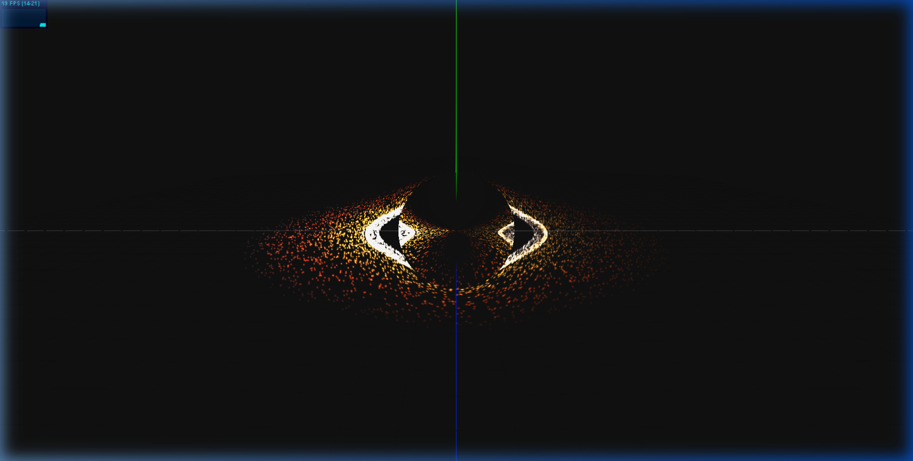

# Real-Time Black Hole Simulation




A physically-inspired, real-time simulation of a Schwarzschild black hole, featuring gravitational lensing effects and an accretion disk. Built with Three.js and custom GLSL shaders.

## 🚀 Overview

This project aims to visualize the complex relativistic effects around a non-rotating (Schwarzschild) black hole. It provides a real-time interactive environment where users can observe light-bending phenomena and the dynamics of an accretion disk.

## ✨ Features

- **Physically Informed Physics**: Accurately calculates the Schwarzschild Radius ($r_s$), Photon Sphere ($1.5r_s$), and Innermost Stable Circular Orbit (ISCO, $3r_s$).
- **Gravitational Lensing**: Custom post-processing shaders simulate the bending of light paths around the singularity.
- **Dynamic Accretion Disk**: Procedural disk rendering with particle-like effects and orbital mechanics.
- **Interactive Controls**: Fluid orbit controls for observing the black hole from various distances and angles.
- **Real-Time Performance**: Optimized rendering loop capable of maintaining high frame rates at modern resolutions.
- **Unit Conversion**: Seamlessly scales between physical SI units (meters, solar masses) and simulation units.

## 🛠️ Technology Stack

- **Core**: [Three.js](https://threejs.org/) (WebGL Framework)
- **Math**: [gl-matrix](https://glmatrix.net/)
- **Shaders**: custom GLSL (Vertex & Fragment)
- **Build Tool**: [Vite](https://vitejs.dev/)
- **UI**: [lil-gui](https://github.com/georgealways/lil-gui) (for real-time parameter tweaking)

## 📦 Getting Started

### Prerequisites

- [Node.js](https://nodejs.org/) (v18 or higher recommended)
- [npm](https://www.npmjs.com/) or [yarn](https://yarnpkg.com/)

### Installation

1. Clone the repository:
   ```bash
   git clone https://github.com/frag2win/BLACK-HOLE.git
   cd BLACK-HOLE
   ```

2. Install dependencies:
   ```bash
   npm install
   ```

3. Start the development server:
   ```bash
   npm run dev
   ```

4. Open your browser and navigate to `http://localhost:5173`.

## 🔬 Physics Context

The simulation centers on a **Schwarzschild Black Hole**, which is the simplest type of black hole—one that has mass but no electric charge or angular momentum. 

- **Schwarzschild Radius ($r_s$):** The radius of the event horizon.
- **Photon Sphere ($1.5r_s$):** The distance at which photons are forced to travel in orbits.
- **ISCO ($3r_s$):** The closest stable orbit for massive particles.

## 🗺️ Project Structure

```text
├── src/
│   ├── core/           # Scene management and render loop
│   ├── physics/        # Black hole logic and unit converters
│   ├── rendering/      # Three.js object wrappers and post-processing
│   ├── shaders/        # GLSL code for lensing and disk effects
│   ├── utils/          # Constants and math helpers
│   └── main.js         # Entry point
├── index.html          # Main HTML entry
└── vite.config.js      # Vite configuration
```

## 🛣️ Roadmap

- [ ] **Phase 2**: Implement Kerr (rotating) black hole metrics.
- [ ] **Phase 3**: Relativistic Doppler beaming and red-shift effects.
- [ ] **Phase 4**: Advanced volumetric accretion disk rendering.
- [ ] **Phase 5**: Starfield background with real-time lensing.

## 📄 License

This project is licensed under the MIT License - see the [LICENSE](LICENSE) file for details.

## 🤝 Contributing

Contributions are welcome! If you have suggestions for performance improvements or physics accuracy, feel free to open an issue or pull request.
